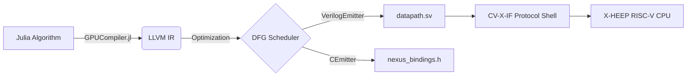

# Nexus-V (Neural & Encryption eXtension Utility System for RISC-V)

[](https://julialang.org/)
[](https://ieeexplore.ieee.org/document/8299595)
[](https://riscv.org/)
[](https://opensource.org/licenses/MIT)

**Nexus-V** is an open-source, automated Hardware/Software Co-Design framework and High-Level Synthesis (HLS) compiler. 

Enabling developers to write compute-intensive mathematical algorithms targeting **Edge AI (TinyML)** and **Lattice-Based Post-Quantum Cryptography (PQC)** in **Julia**, and automatically synthesizes them into **RISC-V CV-X-IF compliant hardware accelerators**.

Unlike traditional EDA macro-generators, Nexus-V aims to be an algorithmic synthesizer. It intercepts Julia code at the LLVM IR level, performs hardware-specific optimizations (loop unrolling, pipelining), schedules the dataflow graph, and emits both the physical **SystemVerilog RTL** and the corresponding **RISC-V C-software bindings**.

## Why Nexus-V?
* **Zero Core Modifications:** Utilizes the standardized OpenHW CV-X-IF coprocessor interface. Generated hardware is loosely coupled, meaning you never need to re-verify the host RISC-V CPU.
* **Pure Algorithmic Input:** No need to hand-write Verilog templates or YAML descriptors. Your algorithm *is* your hardware specification.
* **Modern Workloads:** Built explicitly to tackle the two most demanding edge-computing problems today: Neural Network Convolutions (MAC arrays) and Lattice Cryptography (Modular Polynomial Arithmetic).
* **ASIP Paradigm:** Operates similarly to commercial Application-Specific Instruction-set Processor (ASIP) generators (like Cadence Xtensa), but fully open-source and built on RISC-V.

---

## System Architecture

Nexus-V bridges the gap between software intent and silicon execution through a 4-stage pipeline:

1. **Frontend (Julia Metaprogramming):** The user tags a Julia function with `@nexus_accelerate`.
2. **Middle-End (LLVM IR Extraction):** Using `GPUCompiler.jl`, the framework bypasses CPU compilation, lowering the math into pure LLVM Intermediate Representation, applying HLS optimizations (loop unrolling, constant folding).
3. **Backend (HLS & DFG Scheduling):** The LLVM IR is parsed into a Data-Flow Graph (DFG). Nexus-V performs ALAP/ASAP scheduling and resource binding.
4. **Emitter (HW/SW Generation):** The tool emits a synthesizable SystemVerilog `datapath.sv`, automatically routes it inside a pre-written CV-X-IF SystemVerilog FSM shell, and emits standard C inline-assembly (`.insn`) to call the hardware.



---

## Repository Structure

```text
NexusV/
├── Project.toml                 # Julia project dependencies (GPUCompiler, LLVM, MacroTools)
├── src_julia/                   # The Nexus-V HLS Compiler 
│   ├── NexusV.jl                # Core macros (@nexus_accelerate)
│   ├── IR_Extractor.jl          # GPUCompiler hooks to get bare-metal LLVM IR
│   ├── DFG_Builder.jl           # Parses IR into a Data-Flow Graph
│   ├── Scheduler.jl             # Assigns operations to hardware clock cycles
│   └── Emitters/                # Translates DFG to SystemVerilog & C headers
│
├── hw/                          # Hardware Architecture
│   ├── ext_xheep/               # Baseline X-HEEP RISC-V Environment
│   ├── rtl_static/              # Hand-written CV-X-IF FSM (cvxif_nexus_shell.sv)
│   ├── rtl_generated/           # Output directory for Julia-generated datapaths
│   └── tb_verilator/            # C++ Testbenches for isolated and full-SoC simulation
│
├── sw/                          # Software Benchmarks
│   ├── baseline_c/              # Standard software implementations (Kyber, ML MACs)
│   └── custom_c/                # Code utilizing the auto-generated HW headers
│
└── docs/                        # Architecture specs and CV-X-IF integration guides
```