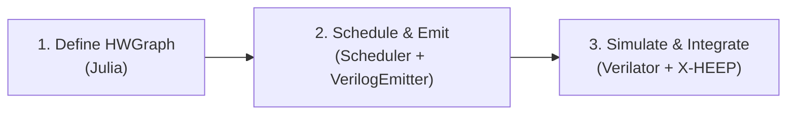

# Nexus-V A Hardware Acceleration Framework
[](https://julialang.org/)
[](https://ieeexplore.ieee.org/document/8299595)
[](https://riscv.org/)
[](https://opensource.org/licenses/MIT)


**Nexus-V** is an open-source hardware acceleration framework for RISC-V. It lets you describe a computation once  as a dataflow graph in Julia, or as a call into a library of hand-optimized IP blocks  and turns it into a pipelined, [CV-X-IF](https://docs.openhwgroup.org/projects/openhw-group-core-v-xif/)-compliant coprocessor that plugs straight into the [X-HEEP](https://github.com/esl-epfl/x-heep) RISC-V microcontroller, with the routing logic to dispatch between multiple accelerators auto-generated for you.

You define your math. Nexus-V takes that and moves it to either

- a general dataflow-graph-to-RTL compiler (schedule it, pipeline it, emit it) or 
- a curated library of hand-crafted, expert-tuned datapaths (SIMD, modular arithmetic, memory-backed algorithms)

...all routed through the *same* auto-generated dispatcher, so both kinds of accelerator look identical to the CPU issuing instructions.

Writing a RISC-V coprocessor by hand today means: hand scheduling your pipeline stages, hand-wiring the mux if you want more than one custom instruction, and redoing all of it for the next algorithm.

## What it delivers today

This section is a snapshot of what's actually implemented and verified, not the vision. See [Roadmap](#roadmap) for where it's going.

**The compiler core**
- A dataflow-graph IR (`HWGraph` / `DFGNode`) with 12 opcodes: arithmetic (`ADD`, `SUB`, `MUL`), bitwise (`SHR`, `SHL`, `AND`, `OR`, `XOR`), `MOD`, a conditional `MUX` (ternary select), plus `ARG`/`CONST`/`RET` and an escape hatch (`OP_PRIMITIVE`) for opting a node out of auto-scheduling entirely.
- A **multi-cycle-aware ASAP scheduler** that takes opcode latencies (`MUL` > `ADD`) and chains dependent operations correctly via topological sort + finish-cycle tracking, rather than assuming everything is single-cycle.
- A **Verilog emitter** that turns a scheduled graph into a correctly-pipelined SystemVerilog module: automatic pipeline register insertion, per-node combinational/registered wire resolution, and a `done_o` shift register matching the graph's true pipeline depth  with the standardized `clk_i / rst_ni / start_i / rs1_i / rs2_i / rd_o / done_o` contract every datapath in the system shares.

**The primitive library**
- A registry (`PrimitiveLibrary`) mapping names to hand-written SystemVerilog modules with declared latency and parameters, such as:
  - `nexus_simd_mac`: 4-lane 8-bit SIMD multiply-accumulate with adder-tree reduction.
  - `nexus_saturating_add`: saturating addition for fixed-point arithmetic.
  - `nexus_barret_reduction`: for NTT and other modular arithmetic.
  - `nexus_scratchpad`: dual-port scratchpad SRAM for accelerators that need local, address-indexed state beyond what two 32-bit operands can carry the foundation for array/vector algorithms like NTT.

**The dispatch layer  the part that makes this a *framework* and not four one-off accelerators**
- A build manifest (`scripts/build_manifest.jl`) listing every datapath in the system by name, `funct3` ID, and latency.
- `DispatcherEmitter.jl` turns that manifest into `nexus_mux.sv`


**The CV-X-IF integration**
- `cvxif_nexus_shell.sv`: a hand-written 4-state FSM (`IDLE → WAIT_COMMIT → WAIT_DATAPATH → SEND_RESULT`) implementing the CV-X-IF issue/commit/result handshake, independently Verilator-tested and passing.
- `nexus_top.sv` wires the shell, mux, and X-HEEP's `if_xif` interface not yet full-system simulated.


**The Software**
- A Julia-function to LLVM-IR path via `GPUCompiler.jl` exists (`src/Compiler/`), with loop-unrolling annotation support (`@nexus_unroll`). The LLVM-IR `HWGraph` translation layer that would make this fully automatic is under active development by a collaborator; today the frontend is exercised through `MockFrontend.jl`.




## How to use it

### Adding a new auto-generated datapath

```julia
using .DFG_Builder

graph = HWGraph("my_accel", Dict(
    1 => DFGNode(1, OP_ARG,   32, [],    nothing, 0, 0, nothing, Dict()),
    2 => DFGNode(2, OP_ARG,   32, [],    nothing, 0, 0, nothing, Dict()),
    3 => DFGNode(3, OP_MUL,   32, [1,2], nothing, 0, 0, nothing, Dict()),
    4 => DFGNode(4, OP_RET,   32, [3],   nothing, 0, 0, nothing, Dict()),
), [1, 2], [4])

schedule_asap!(graph)
emit_verilog(graph, "hw/rtl/my_accel.sv")
```

### Adding a hand-optimized primitive

Write the SystemVerilog module under `hw/rtl/primitives/` following the standard `clk_i/rst_ni/start_i/rs1_i/rs2_i/rd_o/done_o` contract, then register it once:

```julia
register_primitive!(PrimitiveSpec(
    :my_primitive, "nexus_my_primitive",
    "primitives/nexus_my_primitive.sv",
    3,                                  # latency in cycles
    Dict(:SOME_PARAM => 4)
))
```

### Wiring either one into the CPU

Add a line to `scripts/build_manifest.jl` and rerun it `nexus_mux.sv` regenerates automatically with your datapath live behind the dispatcher:

```julia
DatapathEntry("my_accel", 4, 2, false, "my_accel.sv"),   # funct3 = 4
```

```bash
julia --project=. scripts/build_manifest.jl
```

### Simulating

```bash
verilator --cc hw/rtl/my_accel.sv --exe hw/tb_veril/tb_generated.cpp --top-module my_accel
make -C obj_dir -f Vmy_accel.mk Vmy_accel
./obj_dir/Vmy_accel
```

See [`docs/HW_Usage_Workflow.md`](docs/HW_Usage_Workflow.md) for the full walkthrough, including shell-level and waveform based debugging.

## Project status

| Component | Status | Notes |
|---|---|---|
| DFG data model | Working | 12 opcodes incl. `OP_MUX`, `OP_PRIMITIVE` |
| Multi-cycle ASAP scheduler | Working | Real per-opcode latency, correct pipeline-depth tracking |
| Verilog emitter | Working | Auto pipeline registers, `done_o` shift register |
| Primitive registry | Working | 2 primitives registered (`simd_mac`, `saturating_add`) |
| Dispatcher generator | Working | `nexus_mux.sv` auto-generated from manifest, 4 datapaths live |
| CV-X-IF shell | Working | Verilator-verified standalone |
| Scratchpad SRAM | Early draft | Module exists; needs a syntax pass and DMA/mem-channel wiring |
| Barrett reduction primitive | Early draft | Combinational only  needs pipelining and registry entry |
| `nexus_top.sv` / X-HEEP integration | In progress | Wired but not yet full-system simulated |
| Montgomery multiplication | Early draft | |
| `@nexus_accelerate` / LLVM IR frontend | Experimental | Codegen path exists; IR→DFG translation in progress (collaborator) |
| Shell-level (multi-instruction) pipelining | Not started | Current shell handles one in-flight instruction at a time |
| PPA / benchmarking harness | Not started | |

### Prerequisites

- Julia 1.9+
- Verilator 5.x
- C++ compiler (`clang++` or `g++`)

## How it's structured

```text
NexusV/
├── src/                               # Julia: the compiler side
│   ├── NexusV.jl                      # Module entry point, public API
│   ├── Core/
│   │   ├── DFG_Builder.jl             # Opcode, DFGNode, HWGraph, OP_LATENCY
│   │   ├── NexusV_Library.jl          # PrimitiveLibrary: the IP registry
│   │   └── NexusV_macro.jl            # @nexus_accelerate macro
│   ├── Compiler/                      # Julia function → LLVM IR (GPUCompiler.jl)
│   │   ├── NexusV_codegen.jl
│   │   ├── NexusV_codegen_llvm.jl     # @nexus_unroll, LLVM optimization passes
│   │   └── FPGA_Compiler.jl
│   └── Frontend/
│       └── MockFrontend.jl            # Stand-in for the LLVM IR → DFG translator
│
├── hw/                                 # Hardware
│   ├── rtl/
│   │   ├── nexus_top.sv               # Top-level: X-HEEP + shell + mux
│   │   ├── cvxif_nexus_shell.sv       # CV-X-IF protocol FSM
│   │   ├── nexus_mux.sv               # AUTO-GENERATED dispatcher  do not hand-edit
│   │   ├── nexus_scratchpad.sv        # Dual-port scratchpad SRAM
│   │   ├── mac_plus_5.sv              # Auto-generated example datapath
│   │   ├── crc_step.sv                # Auto-generated, mixed-opcode datapath
│   │   ├── horner_poly.sv             # Auto-generated, deep-pipeline datapath
│   │   ├── primitives/                # Hand-written IP blocks
│   │   │   ├── nexus_simd_mac.sv
│   │   │   ├── nexus_saturating_add.sv
│   │   │   └── nexus_barret_reduction.sv   # in progress
│   │   └── tb_cvxif.cpp               # Shell-level Verilator testbench
│   ├── src_hw/                        # Julia → RTL generators
│   │   ├── Scheduler.jl               # Multi-cycle ASAP scheduling
│   │   ├── VerilogEmitter.jl          # HWGraph → pipelined SystemVerilog
│   │   ├── DispatcherEmitter.jl       # Manifest → nexus_mux.sv
│   │   └── ResourceAllocator.jl
│   ├── ext_xheep/                     # X-HEEP (git submodule)
│   └── tb_veril/                      # Datapath-level Verilator testbenches
│
├── scripts/
│   └── build_manifest.jl              # Edit this to add/remove datapaths, then run it
│
├── examples/
│   └── example.jl                     # Minimal HWGraph walkthrough
│
├── tests/
│   ├── test_dfg.jl                    # End-to-end: graph → schedule → emit → verify
│   ├── test_graphs_tier1.jl           # Deeper/mixed-opcode scheduler stress tests
│   └── test_macrona.jl
│
├── mocks/                             # Hand-written .ll files for MockFrontend
├── sw/custom_c/                       # Bare-metal C test programs
│
└── docs/
    ├── Hardware.md                    # Shell / datapath / CV-X-IF protocol overview
    ├── HW_Usage_Workflow.md           # Step-by-step: Julia graph → RTL → simulation
    ├── Project_Pipeline.md            # End-to-end repo/toolchain overview
    └── dev/                           # Design notes, algorithm background
```

## Roadmap

Nexus-V's long-term goal is to stop being "a generator for one X-HEEP SoC" and become a genuinely reusable **open-source hardware acceleration framework**... well that's the goal I have in mind but honestly I'm not sure if it's achievable with the limited resources and the state of my knowledge. A place where both auto-scheduled dataflow and hand-optimized IP are first-class, addressable from a single Julia side API, with real benchmark numbers behind every claim.  

**Near term  finish what's in flight**
1. Wire `OP_PRIMITIVE` all the way through `VerilogEmitter.jl` -> emit real module instantiations (not just latency keeping) for primitive nodes sitting inside a generated graph.
2. Fix and finish the scratchpad SRAM module -> connect it to CV-X-IF's currently unused Memory/Memory-Result channels.
3. Finish the Barrett reducer (pipelined, registered, `done_o`-compliant, in the registry).
4. Full-system `nexus_top.sv` simulation on X-HEEP with a real compiled RISC-V ELF -> exercising a custom instruction end to end.
5. Bare-metal C test suite (`sw/custom_c`) -> exercising every datapath behind the mux from real RISC-V code.

**Mid term  make it a real accelerator, not a demo**
6. Resource constrained scheduling: let the scheduler share a limited pool of multipliers/adders across a graph instead of instantiating one per operation, with automatic mux insertion.
7. Shell pipelining: accept a new instruction before the previous one finishes, using CV-X-IF's instruction `id` field for tagging.
8. A PPA benchmarking harness: script Yosys/X-HEEP's existing synthesis flow, extract Fmax/area/LUT numbers automatically, and pair them with `mcycle` based software vs hardware cycle count comparisons.

## Documentation

- [Hardware Architecture](docs/Hardware.md)  Shell, datapaths, and CV-X-IF protocol overview
- [Hardware Workflow](docs/HW_Usage_Workflow.md)  Step-by-step guide: Julia graph to RTL to Verilator simulation
- [Project Pipeline](docs/Project_Pipeline.md)  End to end overview of the repository structure, toolchain, and development flow


## License
Idirene Daris

MIT