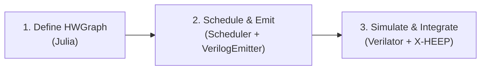

# Nexus-V — A Julia-Based RISC-V Coprocessor Generator

[](https://julialang.org/)
[](https://ieeexplore.ieee.org/document/8299595)
[](https://riscv.org/)
[](https://opensource.org/licenses/MIT)

**Nexus-V** is an open-source toolkit that lets you describe a computation as a dataflow graph in Julia and automatically generates a pipelined, [CV-X-IF](https://docs.openhwgroup.org/projects/openhw-group-core-v-xif/) compliant hardware accelerator module for the [X-HEEP](https://github.com/esl-epfl/x-heep) RISC-V microcontroller.

You define your math. Nexus-V produces the SystemVerilog, the pipeline registers, and the CV-X-IF handshake ready to plug into a real CPU.

---

## How It Works

Nexus-V is a **code generator**, not a full HLS compiler. The flow has three steps:



### Step 1 — Define your computation as a dataflow graph

```julia
# Example: mac_plus_5 computes (rs1 * rs2) + 5
graph = HWGraph("mac_plus_5", Dict(
    1 => DFGNode(1, OP_ARG,   32, [],    nothing, 0),  # rs1
    2 => DFGNode(2, OP_ARG,   32, [],    nothing, 0),  # rs2
    3 => DFGNode(3, OP_CONST, 32, [],    5,       0),  # constant 5
    4 => DFGNode(4, OP_MUL,   32, [1,2], nothing, 0),  # rs1 * rs2
    5 => DFGNode(5, OP_ADD,   32, [4,3], nothing, 0),  # mul_result + 5
    6 => DFGNode(6, OP_RET,   32, [5],   nothing, 0),  # output
), [1,2], [6])
```

### Step 2 — Schedule and emit SystemVerilog

```julia
schedule_asap!(graph)          # Assigns clock cycles (ASAP scheduling)
emit_verilog(graph, "mac_plus_5.sv")  # Writes pipelined SystemVerilog
```

The emitter produces a module with the standardized Nexus datapath interface:

```systemverilog
module mac_plus_5 (
    input  logic        clk_i,
    input  logic        rst_ni,
    input  logic        start_i,
    input  logic [31:0] rs1_i,
    input  logic [31:0] rs2_i,
    output logic [31:0] rd_o,
    output logic        done_o
);
    // Auto-generated pipeline registers and combinational logic
    // ...
endmodule
```

### Step 3 — Plug into X-HEEP via the CV-X-IF shell

The generated datapath slots into `cvxif_nexus_shell.sv`, a hand-written FSM that implements the CV-X-IF protocol (issue → commit → result). The shell sits between the CPU and your datapath:

```
┌─────────────┐   CV-X-IF    ┌───────────────────┐   start/done   ┌───────────────┐
│  cv32e40px   │◄────────────►│ cvxif_nexus_shell  │◄─────────────►│  mac_plus_5   │
│  (CPU core)  │  interface   │   (FSM bridge)     │   handshake   │ (your math)   │
└─────────────┘              └───────────────────┘               └───────────────┘
```

The top-level wrapper (`nexus_top.sv`) owns the `if_xif` interface instance and connects everything to the X-HEEP SoC.

---

## Quick Start

### Prerequisites

- Julia 1.9+
- Verilator 5.x
- C++ compiler (`clang++` or `g++`)

```bash
# Clone with X-HEEP submodule
git clone --recursive https://github.com/MadebyDaris/NexusV.git
cd NexusV
```

### Run the end-to-end test

```bash
# 1. Generate RTL from a Julia graph
julia --project=. tests/test_dfg.jl
# → Emits hw/rtl/mac_plus_5.sv (latency = 3 cycles)

# 2. Build and simulate the generated datapath
verilator --cc hw/rtl/mac_plus_5.sv \
  --exe hw/tb_veril/tb_generated.cpp \
  --top-module mac_plus_5
make -C obj_dir -f Vmac_plus_5.mk Vmac_plus_5
./obj_dir/Vmac_plus_5
# → TEST PASSED (rd_o = 17, expected 17)

# 3. Test the CV-X-IF shell independently
cd hw/rtl
verilator --cc cvxif_nexus_shell.sv \
  --exe tb_cvxif.cpp \
  --top-module cvxif_nexus_shell \
  --Mdir obj_dir_local
make -C obj_dir_local -f Vcvxif_nexus_shell.mk Vcvxif_nexus_shell
./obj_dir_local/Vcvxif_nexus_shell
# → ALL TESTS PASSED
```

---

## Repository Structure

```text
NexusV/
├── Project.toml                  # Julia dependencies
├── src/                          # Julia source code
│   ├── NexusV.jl                 # Module entry point
│   ├── Core/
│   │   ├── DFG_Builder.jl        # HWGraph and DFGNode types
│   │   └── NexusV_macro.jl       # @nexus_accelerate macro
│   ├── Compiler/                 # Experimental: LLVM IR extraction
│   │   ├── NexusV_codegen.jl
│   │   └── NexusV_codegen_llvm.jl
│   └── Frontend/
│       └── MockFrontend.jl       # Test helpers
│
├── hw/                           # Hardware
│   ├── rtl/                      # All RTL sources
│   │   ├── nexus_top.sv          # Top-level: X-HEEP + shell + if_xif
│   │   ├── cvxif_nexus_shell.sv  # CV-X-IF protocol FSM
│   │   ├── mac_plus_5.sv         # Example generated datapath
│   │   └── tb_cvxif.cpp          # Shell-level Verilator testbench
│   ├── src_hw/                   # Julia → RTL generators
│   │   ├── Scheduler.jl          # ASAP dataflow scheduling
│   │   └── VerilogEmitter.jl     # DFG → pipelined SystemVerilog
│   ├── ext_xheep/                # X-HEEP (Git submodule)
│   └── tb_veril/                 # Datapath-level Verilator testbench
│
├── tests/                        # Julia test suite
│   ├── test_dfg.jl               # End-to-end: graph → schedule → emit → verify
│   └── test_macrona.jl           # Macro tests
│
└── docs/                         # Documentation
    ├── Hardware.md               # Hardware architecture overview
    └── HW_Usage_Workflow.md      # Step-by-step simulation guide
```

---

## Project Status

| Component | Status | Description |
|---|---|---|
| DFG data model | Working | `HWGraph`, `DFGNode`, opcodes (add, sub, mul, const, ret) |
| ASAP scheduler | Working | Topological sort + cycle assignment |
| Verilog emitter | Working | Emits pipelined `.sv` with auto pipeline registers and done shift register |
| CV-X-IF shell | Working | 4-state FSM: IDLE → WAIT_COMMIT → WAIT_DATAPATH → SEND_RESULT |
| X-HEEP integration | In progress | `nexus_top.sv` created, needs bug fixes and full system test |
| Datapath mux/dispatcher | Planned | Route multiple datapaths via `funct3` field |
| `@nexus_accelerate` macro | Experimental | Julia function → LLVM IR extraction (GPUCompiler.jl) |
| PQC primitives | Planned | Barrett reduction, Montgomery multiplication as example use-cases |

---

## Roadmap

1. **Fix `nexus_top.sv`** — resolve interface naming bug and missing ports, run full-system simulation
2. **Wire `mac_plus_5` into the shell** — replace the stub datapath with the generated module
3. **Dispatcher mux** — auto-generate a `nexus_mux.sv` that routes multiple custom instructions (by `funct3`) to different datapaths
4. **PQC use-cases** — implement Barrett reduction and Montgomery multiplication as `HWGraph` examples, demonstrate multi-cycle pipelined accelerators
5. **Bare-metal C tests** — write RISC-V programs that exercise custom instructions and verify results on the CPU
6. **Performance benchmarking** — cycle-count comparison (hardware vs. software) using the `mcycle` CSR

---


## Documentation

- [Hardware Architecture](docs/Hardware.md) — Shell, datapaths, and CV-X-IF protocol overview
- [Hardware Workflow](docs/HW_Usage_Workflow.md) — Step-by-step guide: Julia graph → RTL → Verilator simulation
- [Project Pipeline](docs/Project_Pipeline.md) — End-to-end overview of the repository structure, toolchain, and development flow

---

## License

MIT