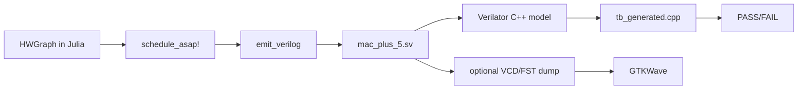

# NexusV Hardware Usage Workflow

This guide documents the current hardware-only flow in this repository while the full Julia frontend is still under construction.

It covers:
- Building an example HWGraph in Julia
- Scheduling and emitting RTL
- Running Verilator simulations for generated datapaths
- Checking generation of `Vmac_plus_5.h`
- Running the CV-X-IF shell testbench
- Optional waveform flow with GTKWave

## 1. Prerequisites

From macOS terminal:

- Julia 1.9+
- Verilator (5.x recommended)
- C++ compiler (`clang++` or `g++`)
- `make`
- GTKWave (optional, for waveform viewing)

Quick checks:

```bash
julia --version
verilator --version
make --version
```

## 2. Repo Paths Used in This Flow

- Graph example: `examples/example.jl`
- Graph types: `src/DFG_Builder.jl`
- Scheduler: `hw/src_hw/Scheduler.jl`
- Verilog emitter: `hw/src_hw/VerilogEmitter.jl`
- End-to-end Julia test: `tests/test_dfg.jl`
- Generated RTL output: `hw/rtl_nexus/mac_plus_5.sv`
- Datapath testbench: `hw/tb_veril/tb_generated.cpp`
- CV-X-IF shell RTL: `hw/rtl_nexus/cvxif_nexus_shell.sv`
- CV-X-IF shell testbench: `hw/rtl_nexus/tb_cvxif.cpp`

## 3. Flow Overview



## 4. Step-by-Step

### Step A: Build and schedule graph in Julia

The sample graph in `examples/example.jl` and `tests/test_dfg.jl` is:

- `node_4 = rs1 * rs2`
- `node_5 = node_4 + 5`
- return `node_5`

Run the end-to-end Julia test (this also emits RTL):

```bash
cd /Users/didirene/Documents/Daris/NexusV
julia --project=. tests/test_dfg.jl
```

Expected output includes:

- `Scheduling: PASS  (latency=3)`
- `Emit: PASS  (written to .../hw/rtl_nexus/mac_plus_5.sv)`

### Step B: Compile generated RTL with Verilator (datapath TB)

Build and link testbench:

```bash
cd /Users/didirene/Documents/Daris/NexusV
verilator --cc hw/rtl_nexus/mac_plus_5.sv \
  --exe hw/tb_veril/tb_generated.cpp \
  --top-module mac_plus_5
make -C obj_dir -f Vmac_plus_5.mk Vmac_plus_5
```

Run simulation:

```bash
./obj_dir/Vmac_plus_5
```

Expected output:

- `done_o asserted`
- `rd_o = 17  (expected 17)`
- `TEST PASSED`

### Step C: Check generation of `Vmac_plus_5.h`

After the Verilator build, verify artifact existence:

```bash
cd /Users/didirene/Documents/Daris/NexusV
ls obj_dir/Vmac_plus_5.h
```

This header is what the C++ testbench includes:

```cpp
#include "Vmac_plus_5.h"
```

### Step D: Run CV-X-IF shell testbench

For shell-level testing, use a fresh output directory (`--Mdir`) to avoid stale host-specific makefiles from previously generated `obj_dir` content.

```bash
cd /Users/didirene/Documents/Daris/NexusV/hw/rtl_nexus
verilator --cc cvxif_nexus_shell.sv \
  --exe tb_cvxif.cpp \
  --top-module cvxif_nexus_shell \
  --Mdir obj_dir_local
make -C obj_dir_local -f Vcvxif_nexus_shell.mk Vcvxif_nexus_shell
./obj_dir_local/Vcvxif_nexus_shell
```

Expected output ends with:

- `Test 1: PASS`
- `Shell back in IDLE after kill: PASS`
- `ALL TESTS PASSED`

## 5. Optional: Waveforms with GTKWave

Current testbenches are functional and print pass/fail, but do not yet dump waveforms by default. To view waveforms:

1. Rebuild with tracing enabled:

```bash
verilator --cc hw/rtl_nexus/mac_plus_5.sv \
  --exe hw/tb_veril/tb_generated.cpp \
  --top-module mac_plus_5 \
  --trace --Mdir obj_dir_trace
make -C obj_dir_trace -f Vmac_plus_5.mk Vmac_plus_5
```

2. Add VCD dump calls in testbench (`tb_generated.cpp`) using `VerilatedVcdC`:

- include `verilated_vcd_c.h`
- call `Verilated::traceEverOn(true);`
- call `dut->trace(tfp, 99);`
- call `tfp->open("wave.vcd");`
- call `tfp->dump(sim_time);` each half-cycle or cycle
- close file at end with `tfp->close();`

3. Open waveform:

```bash
gtkwave wave.vcd
```

Signals to inspect:

- `clk_i`, `rst_ni`, `start_i`
- `rs1_i`, `rs2_i`, `rd_o`
- `done_o`
- pipeline internals such as `n4_comb`, `n4_r2`, `done_shift`

## 6. What Is Already Verified In This Repo

Verified in this environment:

- `julia --project=. tests/test_dfg.jl` passes and emits `mac_plus_5.sv`
- Verilator build for `mac_plus_5` succeeds
- `obj_dir/Vmac_plus_5.h` is generated
- `./obj_dir/Vmac_plus_5` reports `TEST PASSED`
- Shell flow passes when built with `--Mdir obj_dir_local`

## 7. Typical Iteration Loop

For each new HWGraph:

1. Define/modify graph nodes in Julia
2. Run scheduler (`schedule_asap!`)
3. Emit RTL (`emit_verilog`)
4. Build with Verilator
5. Run testbench and check expected result
6. Inspect waveforms if timing/handshake debugging is needed
