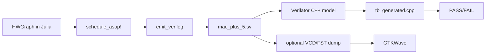

# NexusV Hardware Usage Workflow

This guide documents the current hardware flow: defining a dataflow graph in Julia, generating pipelined RTL, and simulating it with Verilator.

## 1. Prerequisites

- Julia 1.9+
- Verilator (5.x recommended)
- C++ compiler (`clang++` or `g++`)
- `make`
- GTKWave (optional, for waveform viewing)

Quick checks:

```bash
julia --version
verilator --version
make --version
```

## 2. Key Files

| Purpose | Path |
|---|---|
| Example graph | `examples/example.jl` |
| DFG types | `src/Core/DFG_Builder.jl` |
| Scheduler | `hw/src_hw/Scheduler.jl` |
| Verilog emitter | `hw/src_hw/VerilogEmitter.jl` |
| End-to-end test | `tests/test_dfg.jl` |
| Generated RTL | `hw/rtl/mac_plus_5.sv` |
| Datapath testbench | `hw/tb_veril/tb_generated.cpp` |
| CV-X-IF shell | `hw/rtl/cvxif_nexus_shell.sv` |
| Shell testbench | `hw/rtl/tb_cvxif.cpp` |
| Integration top | `hw/rtl/nexus_top.sv` |

## 3. Flow Overview



## 4. Step-by-Step

### Step A: Build and schedule graph in Julia

The sample graph in `tests/test_dfg.jl` computes:

- `node_4 = rs1 * rs2`
- `node_5 = node_4 + 5`
- return `node_5`

Run the end-to-end Julia test (this also emits RTL):

```bash
cd /path/to/NexusV
julia --project=. tests/test_dfg.jl
```

Expected output includes:

- `Scheduling: PASS  (latency=3)`
- `Emit: PASS  (written to .../hw/rtl/mac_plus_5.sv)`

### Step B: Compile generated RTL with Verilator (datapath TB)

Build and link testbench:

```bash
cd /path/to/NexusV
verilator --cc hw/rtl/mac_plus_5.sv \
  --exe hw/tb_veril/tb_generated.cpp \
  --top-module mac_plus_5
make -C obj_dir -f Vmac_plus_5.mk Vmac_plus_5
```

Run simulation:

```bash
./obj_dir/Vmac_plus_5
```

Expected output:

- `done_o asserted`
- `rd_o = 17  (expected 17)`
- `TEST PASSED`

### Step C: Run CV-X-IF shell testbench

For shell-level testing, use a fresh output directory (`--Mdir`) to avoid stale artifacts:

```bash
cd /path/to/NexusV/hw/rtl
verilator --cc cvxif_nexus_shell.sv \
  --exe tb_cvxif.cpp \
  --top-module cvxif_nexus_shell \
  --Mdir obj_dir_local
make -C obj_dir_local -f Vcvxif_nexus_shell.mk Vcvxif_nexus_shell
./obj_dir_local/Vcvxif_nexus_shell
```

Expected output ends with:

- `Test 1: PASS`
- `Shell back in IDLE after kill: PASS`
- `ALL TESTS PASSED`

### Step D: Integration test with `nexus_top` (in progress)

`nexus_top.sv` connects X-HEEP + the shell + the datapath together. Full-system simulation requires:

1. An OBI memory model
2. A compiled RISC-V ELF loaded into simulated SRAM
3. A system-level testbench

This is not yet set up. See `docs/dev/implementation_notes.md` for the plan.

## 5. Optional: Waveforms with GTKWave

1. Rebuild with tracing enabled:

```bash
verilator --cc hw/rtl/mac_plus_5.sv \
  --exe hw/tb_veril/tb_generated.cpp \
  --top-module mac_plus_5 \
  --trace --Mdir obj_dir_trace
make -C obj_dir_trace -f Vmac_plus_5.mk Vmac_plus_5
```

2. Add VCD dump calls in testbench (`tb_generated.cpp`) using `VerilatedVcdC`:

- Include `verilated_vcd_c.h`
- Call `Verilated::traceEverOn(true);`
- Call `dut->trace(tfp, 99);`
- Call `tfp->open("wave.vcd");`
- Call `tfp->dump(sim_time);` each half-cycle or cycle
- Close file at end with `tfp->close();`

3. Open waveform:

```bash
gtkwave wave.vcd
```

Signals to inspect:

- `clk_i`, `rst_ni`, `start_i`
- `rs1_i`, `rs2_i`, `rd_o`
- `done_o`
- Pipeline internals: `n4_comb`, `n4_r2`, `done_shift`

## 6. Verified in This Repo

- `julia --project=. tests/test_dfg.jl` passes and emits `mac_plus_5.sv`
- Verilator build for `mac_plus_5` succeeds
- `./obj_dir/Vmac_plus_5` reports `TEST PASSED`
- Shell flow passes when built with `--Mdir obj_dir_local`

## 7. Typical Iteration Loop

For each new computation you want to accelerate:

1. Define the dataflow graph nodes in Julia (`HWGraph`)
2. Run the scheduler (`schedule_asap!`)
3. Emit RTL (`emit_verilog`)
4. Build with Verilator
5. Run testbench and check expected result
6. Inspect waveforms if timing/handshake debugging is needed
